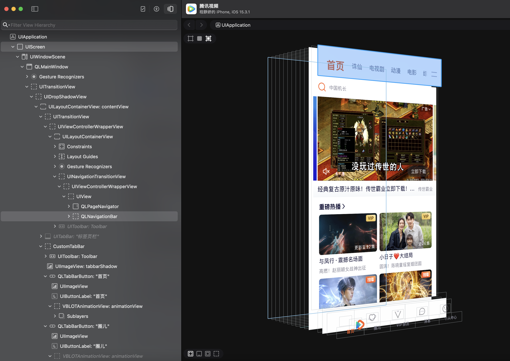

# iOS 越狱的Tweak开发

> iOS越狱开发中，各种破解补丁的统称为Tweak,通常意义上我们说的越狱开发,都是指开发一个Tweak.
基本上,tweak都依赖于一个名叫[cydia Substrate](http://www.cydiasubstrate.com) (以前名字也叫mobile Substrate)的动态库,Mobile Substrate是Cydia的作者Jay Freeman (@saurik)的作品，也叫Cydia Substrate,它的主要功能是hook某个App，修改代码比如替换其中方法的实现，Cydia上的tweak都是基于Mobile Substrate实现的.

> iOS的tweak开发可以有两种发布方式   
  1.  只能在越狱设备上安装的打包成deb格式的安装包  
  2.  直接使用开发者自己的证书/企业证书直接将补丁打包成ipa,这样不需要越狱也是可以安装的,只是这种非越狱的限制比较大,通常只是用来给某个app打个补丁或者类似的功能啥的

# RevealLoaderInject
动态加载Reveal到应用程序和插件中。此包使用Reveal 最新的的revealserver.framework，您可以将其替换为您想要的内容。兼容iOS 15 +。如果遇到问题，可以按照步骤自己编译

# 手动安装
1. 下载安装包 https://github.com/DeftMKJ/MKJRevealLoaderX/releases/tag/v1.0.0
2. 用iFunBox拖进越狱机，我一般放在var/jb/var/root用户目录下（这个自己根据自己放就好）
3. 越狱机上安装Filza,方便查看手机上文件目录，然后进入上面的目录，点击找到对应文件
4. 点击右边叹号，然后点击右上角，用Sileo安装即可。
> 大概率遇到问题，排查方式
- 先用手机进入/var/jb/Library/Application Support/RevealLoader/RevealServer这，看看这个可执行文件在不在，然后看看是否有-x权限，不行把755安排上
- 如果已存在，但还是不行，使用 ldid 进行伪签名:
在越狱设备上，你可以使用 ldid 工具对动态库进行伪签名。这不是真正的代码签名，但它可以欺骗 AMFI，让它认为库是正确签名的。
安装 ldid（如果尚未安装）并运行以下命令：`ldid -S /path/to/RevealServer`

# 自行编译
1. 下载工程
2. Mac电脑的Reveal下载好，然后进入Helper -- Show Reveal Framwork in Finder
3. 找到xcframework，然后找到ios-arm64，把可执行文件替换 `layout/Library/Application Support/RevealLoader`即可
4. 没报错的话，package目录下有deb包，根据步骤手动安装即可

iOS 15+可行 有问题微信联系我 13826241102
